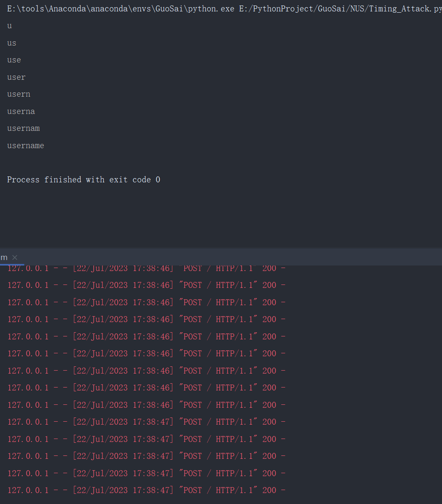

### Demo of Timing Attack

##### Introduction

This is a demo of  timing attack.

##### Build

1.Victim

`docker build -t victim .`

2.Timing_Attack

`docker build -t timing-attack .`

##### Run

1.Victim

`docker run -p 5000:5000 victim`

2.Timing_Attack

`docker run timing-attack`

